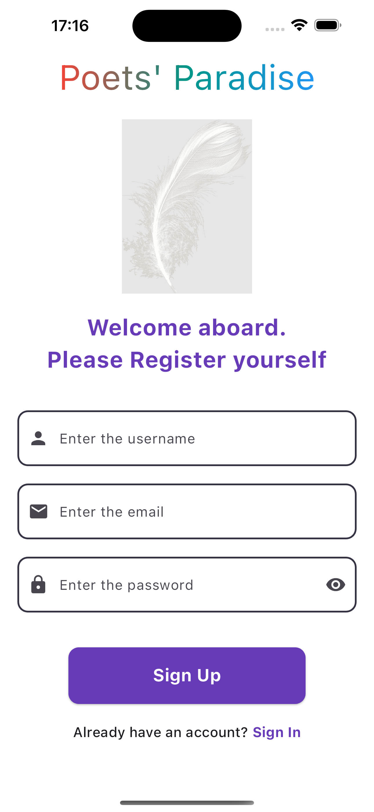
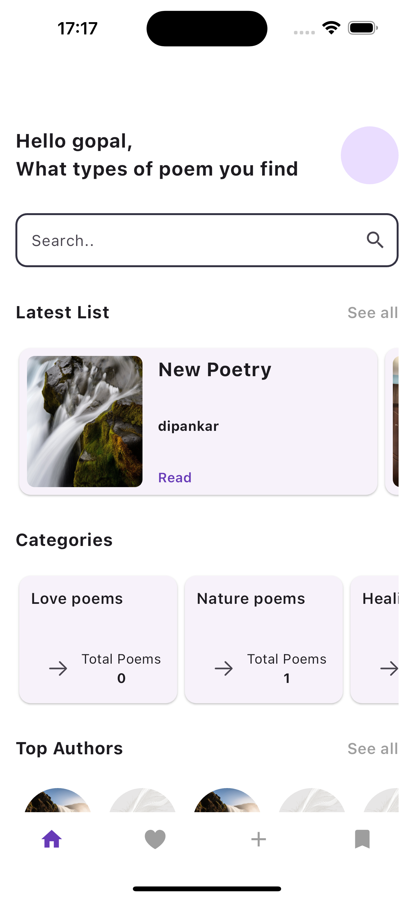

# Poets Paradise

A new Social Media Application for Poetry Enthuciast.

## Motive

The application is developed using flutter and utilizes firebase for backend purpose.
The application follows bloc patterns for state management. Clean architecture is followed to adhere to SOLID principles.

## Tech Stacks

- Flutter
- Firebase
- Bloc Pattern
- Clean Architecture

The application utilizes proper patterns for production level app and uses various packages from pub.dev for making the app build easier.

## You can download the Android apk:

It is totally safe🫠
[apk download link for android](https://drive.google.com/file/d/1QW1C3-o0fII0Y04p9ABmoog6AurBkNNi/view?usp=sharing)

## Screenshots

## Demo Video

[Video](https://drive.google.com/file/d/1AQI7u6s8yTJg_sT04zZdBkiRGmLEXG04/view?usp=sharing)
